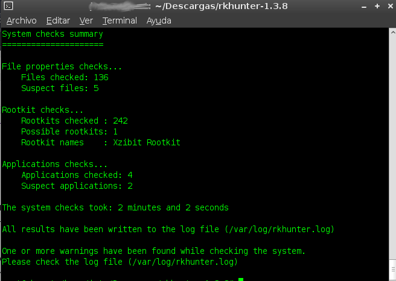

title: Buscando rootkits con Rkhunter
tags: rkhunter, rootkits, security, unix
slug: tutorial-rkhunter
date: 2013-09-23

En este post comparto con ustedes como podemos buscar rootkits, directorios y/o archivos ocultos en nuestro sistema Unix (Linux, BSD, etc.), entre otros, para ello usaremos esta estupenda herramienta llamada Rkhunter o Rootkit Hunter. Es una herramienta bastante conocido así también como chkrootkit que es bastante popular. En este momento no podría recomendar una por encima de la otra. Pero si que es bueno conocer estas herramientas, ya que es
bastante necesario mantener un chequeo rutinario del estado actual de nuestro sistemas para detectar a tiempo posibles intrusiones y actuar conforme el asunto.

Qué es rkhunter?
------------------------------------

Según wikipedia es una herramienta para sistemas [Unix](http://es.wikipedia.org/wiki/Unix "Unix") que detecta los [rootkies](http://es.wikipedia.org/wiki/Rootkits "Rootkits"), las [backdoors](http://es.wikipedia.org/wiki/Puerta_trasera "Puertas traseras o backdoors") y los exploit locales mediante la comparación de los [Hashes MD5](http://es.wikipedia.org/wiki/MD5#Hashes_MD5 "hashes MD5") de ficheros importantes con su firma correcta en una base de datos en línea, buscando los directorios por defecto (de rootkits), los permisos 
incorrectos, los archivos ocultos, las cadenas sospechosas en los módulos del kernel, y las pruebas especiales para GNU/Linux y FreeBSD.

Qué son rootkits?
-----------------

La mayoría de veces son herramientas que se auto-ocultan en los sistemas, estos son utilizados por *blackhats*, *crackers* y *scriptkiddies* para evitar ser descubierto por el administrador del sistema.

Instalando Rkhunter
------------------- 

Para instalar Rkhunter podríamos hacerlo desde los repositorios, ya que esta en lo repositorio de la mayoría de las distros GNU/Linux, o podríamos descargarlos desde su website e instalarlo. Eligiremos la ultima opción, ya que así nos aseguramos de tener la ultima versión del mismo, algo importantísimo en casos como este. En todo caso, si instalamos desde los repositorios podemos actualizar el Rkhunter con

	sudo rkhunter --update 

Recomendable hacerlo antes de usarlo siempre, según he leído por ahí.

Para descargar Rkhunter vamos a [rkhunter](http://sourceforge.net/projects/rkhunter/files/ "esta pagina de acá") y descargamos el archivo **rkhunter-1.3.8.tar.gz**, ultima versión a la fecha de redactar esto, en caso de haber una versión mas reciente cuando este leyendo esto, descarga la mas reciente.

Ahora vamos a donde descargamos el archivo y lo descomprimes

	tar -zxvf rkhunter-1.3.8.tar.gz 

Desde una terminal vamos a la carpeta que se nos creo al descomprimir el archivo, la carpeta tiene el formato de **rkhunter-versión**, en mi caso

	cd rkhunter-1.3.8

Tenemos mas de una manera de instalar el Rkhunter, podemos hacer algunas personalizaciones a nuestra instalación, pero en este caso realizaremos la instalación por defecto. Para ello como usuario root ejecutamos el script *installer.sh*, pero lo hacemos del siguiente modo
 
	./installer.sh --install

Para ver mas información sobre esta y los demás modos de instalación y otras informaciones de interés, recomiendo leerse el archivo README que viene dentro de la carpeta *files* que a su vez se encuentra dentro de la carpeta *rkhunter-1.3.8* o leerlo online en [online](http://rkhunter.cvs.sourceforge.net/viewvc/rkhunter/rkhunter/files/README "este link"). Si todo ha salido bien tenemos una ultima linea de la instalación que dice
	
	Installation complete

Si ha habido algún problema en la instalación recomiendo leer (nuevamente) el archivo README.

Antes de ejecutar el Rkhunter debemos ejecutar el siguiente comando (debemos no es obligatorio).

	rkhunter --propupd

Esto para completar la base de datos de las propiedades del archivo. No te preocupes es automático, tu corres el comando y listo :-)

Buscando rootkits y demás con Rootkit Hunter
--------------------------------------------

De la forma que veremos ahora no solo buscará rootkits en nuestro sistema sino que también buscará directorios ocultos sospechosos,etc.

Bien, para esto de forma por defecto (como usuario root) hacemos los siguiente
   
	rkhunter --check

Y empezará el escaneo inmediatamente, cuando nos diga *[Press &lt;ENTER&gt; to continue]* entonces presionamos Enter para que continué.

Ups! Parece que tengo un rootkit, por suerte, no era mas que un falso positivo, la alerta fue por la aplicación *hdparm* que instale hace unos días, pero desde los repositorios oficiales, como debe de ser.

Por cierto, podemos ver en detalle el resultado del escaneo en el archivo **/var/log/rkhunter.log**, de modo que en caso de tener algún rootkit ahí podemos leer la ruta de su posible ubicación.

La primera vez que ejecutamos Rkhunter recibimos mucho mensajes del tipo Warning, que en muchos casos son solo falsos positivos y son comandos del mismo sistema como /bin/who por ejemplo, por ello y otras razones es bueno leerse las [FAQ](http://rkhunter.cvs.sourceforge.net/viewvc/rkhunter/rkhunter/files/FAQ "FAQ de Rkhunter")

*Nota: Rkhunter no elimina los rootkits ni otros binarios maliciosos, solo los detecta el resto va por tu cuenta.*

Si quisiéramos hacer un escaneo y que no nos muestre tanta información como con la opción *--check*, para buscar solo rootkits podríamos ejecutar 
   
	rkhunter --enable rootkits

Si queremos saber como podemos automatizar los escaneos para que se ejecuten periódicamente en las FAQ podemos leer como hacerlo (ver link arriba). Además para conocer todas las opciones de Rkhunter podemos correr el comando
 
	rkhunter --help

Algo mas que es positivo es subscribirnos a la lista de correos para recibir información sobre bugs y otras cuestiones de seguridad relacionadas con Rkhunter, para eso podemos ir a [user-mailing-lists](https://lists.sourceforge.net/lists/listinfo/rkhunter-usershttps://lists.sourceforge.net/lists/listinfo/rkhunter-users "rkhunter-user-mailling list")

Si por alguna razón quisiéramos desinstalar el Rkhunter vamos a la carpeta descomprimida del programa y ejecutamos el script de instalación con la opción *---remove*

	./installer.sh --remove

Hasta aquí el post, para mas información recomiendo consultar el manual de rkhunter, y leer las FAQ, así como seguir los demás consejos que he dado, que son los que recomiendan ellos mismos en su website. 

Nos leemos!

*Nota: Aunque este tutorial es 100% valido aún, cabe decir que data ya de un tiempo, fue rescatado de mi antiguo blog.*
